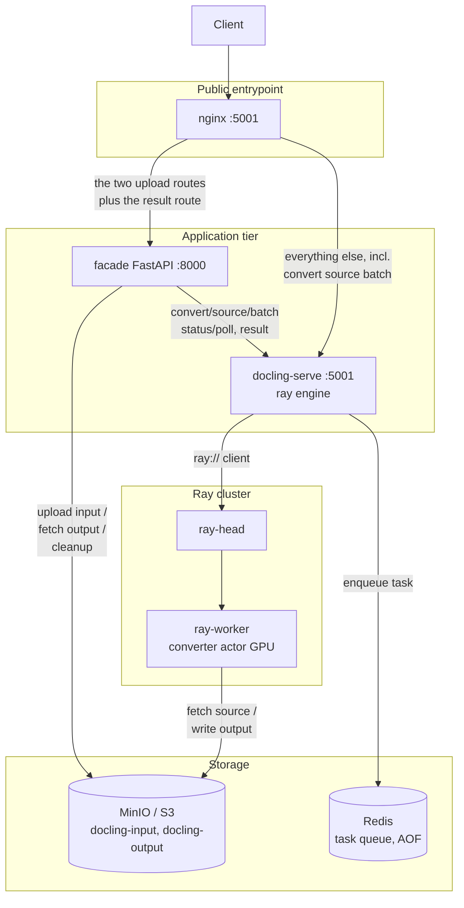
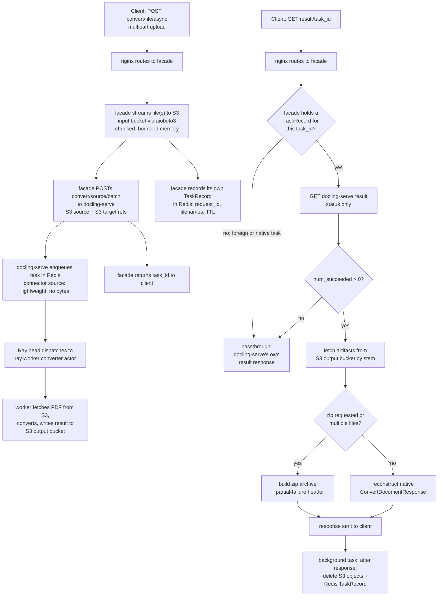

# Architecture

## Motivation

This project is a self-hosted, GPU-accelerated deployment of
[docling-serve](https://github.com/docling-project/docling-serve) behind
[Ray Serve](https://docs.ray.io/en/latest/serve/index.html), built around two
real problems found in docling-serve v1.29.0 / docling-jobkit 3.2.0's Ray
orchestrator while operating it. Neither is a configuration mistake on this
repo's side — both are traced to root cause in upstream code (see
[`upstream-issue-draft.md`](../upstream-issue-draft.md) for the full write-up
with reproductions).

### Bug 1 — every S3-source batch conversion fails under Ray

`SourceChunkConvertRequest.chunk` is typed `DocumentChunk[Any, Any]` — a
dynamically-parameterized Pydantic generic with no stable, importable
qualname. Ray has to serialize that value across the Serve-replica process
boundary (coordinator → converter actor) for every S3-source fan-out call,
and deserialization fails instantly:

```
ray.exceptions.RaySystemError: System error: 'type'
KeyError: 'type'  (inside pickle.loads on the receiving replica)
```

The task reports `task_status: success` at the top level, but every document
fails (`num_succeeded: 0`) and nothing reaches the target bucket — before the
converter ever runs. This isn't specific to `Any`; it reproduces with any
subscripted Pydantic generic crossing that boundary, so it would silently
resurface for any future connector (Azure Blob, GCS, ...) typed the same way.

**Fix**: `src/patches/docling_jobkit/orchestrators/ray/models.py` re-types the
field as the bare `DocumentChunk` — same runtime validation (the class already
has `arbitrary_types_allowed=True`), just without the coercion into an
unpicklable dynamic class. Layered onto the official base image via
Bazel/rules_oci (see [Deployment](#deployment)). Verified end-to-end against a
live MinIO + Ray cluster: 5/5 documents failed before the patch, 5/5 succeeded
after.

### Bug 2 — multipart uploads durably persist full document bytes (and connector credentials) into Redis

The orchestrator's task-admission path base64-encodes the *entire* uploaded
document into the `Task` object it constructs, then `RPUSH`es it onto a Redis
list backed by `--appendonly yes` (AOF). This is the fate of **every**
multipart upload (`/v1/convert/file`, `/v1/convert/file/async`) and every
inline source request — the sync endpoint isn't exempt either, it goes
through the identical `enqueue()` path before blocking on the poll. Separately,
the serialization helper used for this persistence does not redact
`SecretStr`/`SecretBytes` fields — it actively restores their plaintext value
first, so any connector source carrying credentials (S3 access/secret keys)
gets written to that same AOF-persisted log in cleartext.

Measured on a real 50MB PDF: **~63.6MB written to Redis's AOF** through the
raw `/v1/convert/file` endpoint. AOF only shrinks on a Redis-triggered
rewrite (`BGREWRITEAOF`) — not when the task completes or is dequeued — so
Redis's disk footprint tracks *total historical document volume*, not queue
depth.

The one route that avoids this is `/v1/convert/source/batch` used with a
genuine connector source (e.g. an S3 reference) — connector sources are
validated as lightweight config and never hit the base64-embedding branch.
That's not a config flag docling-serve exposes on the endpoints clients
actually want to use, though; it's a structural side effect of a different,
less-obvious endpoint. There's no proposed upstream fix yet (it's a real
architectural change, not a one-liner), so this repo works around it at the
client boundary instead: **the facade**.

### The facade: a claim-check shim, not a permanent architecture

The facade is a small FastAPI service that intercepts exactly the two unsafe
routes (`/v1/convert/file`, `/v1/convert/file/async`) and the result endpoint
needed to serve them, and re-implements them on top of the *safe* path:
upload to S3 itself, submit via `/v1/convert/source/batch`, reconstruct
docling-serve's native response shape from the S3 output afterward. Same
measured 50MB PDF: **~7.7KB written to Redis's AOF** through the facade —
just a `TaskRecord` reference, no document bytes. Everything else (including
the already-safe `/v1/convert/source/batch`) passes straight through
untouched. If/when docling-serve fixes Bug 2 upstream, the facade's job here
shrinks to nothing and it can be removed without touching any other part of
the stack — it's deliberately scoped as a workaround for a specific gap, not
a general-purpose proxy layer.

## Architecture



### Components

- **nginx** — the one public entrypoint (port `5001`). Routes exactly three
  paths to the facade (`/v1/convert/file`, `/v1/convert/file/async`,
  `/v1/result/*`); everything else goes straight to `docling-serve`
  unmodified, including `/v1/convert/source/batch`, which is already
  S3-native and byte-free. Config: `src/nginx/nginx.conf`.
- **facade** — see [Motivation](#motivation) above. FastAPI app
  (`src/facade/{main,service,dependencies,utils,schemas}.py`). Streams
  uploads to S3 via `aioboto3`'s async multipart `upload_fileobj` instead of
  buffering them in memory, so peak RAM per upload is bounded by the client's
  part size, not file size. Deletes its S3 objects and its own Redis record
  once a result has been delivered — that storage is single-use.
- **docling-serve** — runs with `DOCLING_SERVE_ENG_KIND=ray`, connecting to
  the Ray cluster over `ray://ray-head:10001`. Owns its own task queue in
  Redis (a different concern than the facade's small `TaskRecord` keys) and
  its own converter dispatch logic.
- **Ray head / ray-worker** — a single-node head + worker pair. The worker
  runs the GPU converter actor, pinned to exactly one warm replica (a 10GB
  VRAM budget), with PDF page-slice fan-out enabled so a single large
  document can still parallelize within that one replica's concurrency limit.
- **Redis** — `--appendonly yes` (AOF), shared by docling-serve's task queue
  and the facade's own lightweight `TaskRecord`s (a separate key prefix,
  `facade:task:*`, `SET ... EX <ttl>`, not `RPUSH`).
- **MinIO / S3** — two buckets, `docling-input` and `docling-output`. Real
  deployments would point `FACADE_S3_*` / the Ray converter's AWS config at
  any S3-compatible endpoint; MinIO here is purely the local/dev stand-in.

## Request flow: the claim-check path

Tracing `POST /v1/convert/file/async` through to `GET /v1/result/{task_id}`
— the two routes the facade actually reworks (`src/facade/service.py`):



Two details worth calling out:

- **Cleanup runs strictly after the response is sent.** It's a FastAPI
  `BackgroundTasks` entry, not inline — delivery is never delayed or put at
  risk by the cleanup step, and cleanup is best-effort (logs and swallows
  failures rather than raising, since there's no request left to surface an
  error to by the time it runs).
- **The synchronous `/v1/convert/file` endpoint is the same flow plus a
  poll.** `service.submit_file_upload` is identical; `main.convert_file_sync`
  just adds `wait_for_completion` (mirroring docling-serve's own
  `_wait_task_complete`) before falling into the same result-reconstruction
  path as the async+poll case.

## Testing

```bash
bazel test //...              # fast, hermetic — no Docker needed
bazel test //:test.docker     # Docker-dependent — needs a real daemon
```

- **`bazel test //...`** — container structure tests (build each OCI image,
  assert on its filesystem/entrypoint via `container_structure_test`'s tar
  driver, no daemon needed), the facade's pytest unit suite, and
  `//tools/format:format_test` (formatting check, see below). All hermetic,
  runs on every commit locally and in CI.
- **`bazel test //:test.docker`** — the patch-import check (proves the Ray
  pickling fix is actually the code that gets *imported* at runtime, not
  just present in the tarball — a real, distinct failure mode from a plain
  structure test), plus testcontainers-driven integration and e2e layers
  (real `docker compose` stacks, a real Docker socket). Tagged `manual` in
  Bazel — excluded from a plain `//...` sweep, named explicitly here or via
  CI. GitHub-hosted runners have no GPU, so CI runs this suite against a
  CPU-only image variant instead (`DOCLING_COMPOSE_CPU_OVERLAY=1`, see
  `tests/ci/`); locally, against real GPU hardware, it uses the unmodified
  stack.
- **Functional vs. structural**: each of `src/facade/`, `src/nginx/`, and the
  Ray patch splits its tests into `tests/functional/` (real test code) and
  `tests/structural/` (`container_structure_test` YAML configs).
- **Integration vs. e2e**: `tests/integration/` proves the facade's
  claim-check logic against a genuinely running `docling-serve`, with nginx
  deliberately excluded — that's `tests/e2e/`'s job, which additionally
  proves the routing itself (hitting everything through nginx, the only path
  a real client would use).
- **Formatting and linting** — ruff (Python), buildifier (Starlark), yamlfmt
  (YAML), and a ruff lint aspect, mirroring Artemis's own convention:

  ```bash
  bazel run //:format                                   # auto-fix in place
  bazel test //tools/format:format_test                  # check only
  bazel build --aspects=//tools/lint:linters.bzl%ruff \
      --output_groups=rules_lint_human \
      --@aspect_rules_lint//lint:fail_on_violation //...  # ruff lint, repo-wide
  ```

## Deployment

- **Bazel/rules_oci** — reproducible builds for all three custom images
  (patched `docling-serve`, `facade`, `nginx`), each pinned to its upstream
  base by digest in `MODULE.bazel`. `bazel run //:load.all` builds and loads
  all three into the local Docker daemon in one command.
- **`Containerfile` fallbacks** — each image also has a plain
  `docker build`-able `Containerfile` next to its own `BUILD.bazel`
  (`src/patches/docling_jobkit/orchestrators/ray/Containerfile`,
  `src/facade/Containerfile`), for anyone iterating without Bazel set up.
- **`docker compose up`** — brings up the full stack against the locally
  loaded/built images: MinIO, Redis, ray-head/ray-worker, `docling-serve`,
  `facade`, `nginx`. Only `nginx` (`5001`) and MinIO (`9000`/`9001`, for
  direct S3-source-batch uploads bypassing the facade — see
  `scripts/send_pdf.py`) publish host ports; everything else is reachable
  only over the internal Compose network.
- **CI/CD** (`.github/workflows/`):
  - `ci.yml` — on every PR and push to `main`: `lint` (the ruff aspect
    above) runs first and gates `test` (`bazel test //...`) and
    `test-docker` (the Docker-dependent suite, CPU-only), which then run in
    parallel with each other. On push to `main`, once all three pass, also
    pushes the three production images to GHCR as `:latest`
    (`ghcr.io/k-sparrow/docling-serve-ray-{patched,facade,nginx}`). The
    CI-only CPU-patched image variant is never pushed — it's test
    infrastructure, not a deployable artifact.
  - `nightly-docker-tests.yml` — the same Docker-dependent suite again, on a
    daily cron plus manual dispatch, as an environment-drift canary
    independent of code changes (intentionally redundant with `ci.yml`'s
    `test-docker` job).
- **Requirements** — Docker Compose, an NVIDIA GPU with drivers + the NVIDIA
  Container Toolkit for the real stack; Bazel (via `bazelisk`) for the
  reproducible builds, optional if using the `Containerfile` fallbacks
  instead; Python 3 with `requirements.in`'s packages to run
  `scripts/send_pdf.py`.
